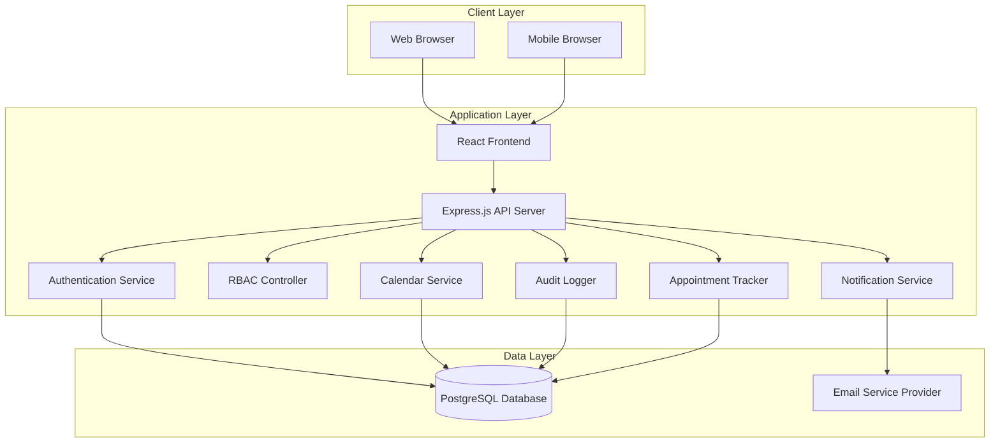

# Design Document: Appointment Booking System

## Overview

The Appointment Booking System is a web-based application built with a modern three-tier architecture consisting of a React frontend, Node.js/Express backend API, and PostgreSQL database. The system implements role-based access control (RBAC) with three distinct user roles: Admin, Staff, and Client, each with specific permissions and capabilities.

The architecture emphasizes security, scalability, and maintainability through clear separation of concerns, comprehensive audit logging, and real-time availability management. The system handles the complete appointment lifecycle from booking through completion, with automated notifications and status tracking throughout the process.

## Architecture

### System Architecture



### Technology Stack

**Frontend:**
- React 18 with TypeScript for type safety
- React Router for client-side routing
- Axios for API communication
- Material-UI for consistent government-appropriate styling
- React Hook Form for form validation

**Backend:**
- Node.js with Express.js framework
- TypeScript for type safety
- JWT for session management
- bcrypt for password hashing
- node-cron for scheduled tasks
- Joi for request validation

**Database:**
- PostgreSQL 14+ for relational data storage
- Database migrations with Knex.js
- Connection pooling for performance

**Infrastructure:**
- Email service integration (SendGrid or similar)
- Environment-based configuration
- Structured logging with Winston

## Components and Interfaces

### Authentication Service

The Authentication Service handles all user authentication, session management, and password operations.

```typescript
interface AuthenticationService {
  // User authentication
  authenticate(email: string, password: string): Promise<AuthResult>
  createSession(userId: string, role: UserRole): Promise<SessionToken>
  validateSession(token: string): Promise<SessionInfo>
  terminateSession(token: string): Promise<void>
  
  // Password management
  validatePasswordComplexity(password: string): boolean
  hashPassword(password: string): Promise<string>
  sendPasswordResetEmail(email: string): Promise<void>
  resetPassword(token: string, newPassword: string): Promise<void>
  
  // User registration
  registerClient(userData: ClientRegistrationData): Promise<User>
}

interface AuthResult {
  success: boolean
  user?: User
  token?: string
  error?: string
}

interface SessionInfo {
  userId: string
  role: UserRole
  isValid: boolean
}
```

### RBAC Controller

The Role-Based Access Control component enforces permissions across all system features.

```typescript
interface RBACController {
  // Permission checking
  hasPermission(userId: string, resource: string, action: string): Promise<boolean>
  enforcePermission(userId: string, resource: string, action: string): Promise<void>
  
  // Role management
  getUserRole(userId: string): Promise<UserRole>
  assignRole(userId: string, role: UserRole): Promise<void>
  
  // Service-specific access
  canAccessService(userId: string, serviceId: string): Promise<boolean>
  assignStaffToService(staffId: string, serviceId: string): Promise<void>
}

enum UserRole {
  CLIENT = 'client',
  STAFF = 'staff',
  MANAGER = 'manager',
  ADMIN = 'admin'
}

interface Permission {
  resource: string
  actions: string[]
}
```

### Calendar Service

The Calendar Service manages appointment availability, prevents double booking, and handles time slot management.

```typescript
interface CalendarService {
  // Availability management
  getAvailableSlots(serviceId: string, date: Date): Promise<TimeSlot[]>
  checkSlotAvailability(serviceId: string, dateTime: Date): Promise<boolean>
  reserveSlot(serviceId: string, dateTime: Date, duration: number): Promise<boolean>
  releaseSlot(serviceId: string, dateTime: Date): Promise<void>
  
  // Service hours validation
  isWithinServiceHours(serviceId: string, dateTime: Date): Promise<boolean>
  getServiceHours(serviceId: string): Promise<ServiceHours>
}

interface TimeSlot {
  dateTime: Date
  available: boolean
  capacity: number
  booked: number
}

interface ServiceHours {
  startTime: string // HH:MM format
  endTime: string
  daysOfWeek: number[] // 0-6, Sunday-Saturday
  capacity: number
}
```

### Appointment Tracker

The Appointment Tracker generates unique tracking numbers and manages appointment identification.

```typescript
interface AppointmentTracker {
  // Tracking number generation
  generateTrackingNumber(): Promise<string>
  validateTrackingNumber(trackingNumber: string): boolean
  
  // Appointment lookup
  findByTrackingNumber(trackingNumber: string): Promise<Appointment | null>
  getAppointmentHistory(clientId: string): Promise<Appointment[]>
}
```

### Notification Service

The Notification Service handles all email communications with users.

```typescript
interface NotificationService {
  // Appointment notifications
  sendBookingConfirmation(appointment: Appointment): Promise<void>
  sendStatusUpdate(appointment: Appointment, oldStatus: string): Promise<void>
  
  // Authentication notifications
  sendPasswordResetEmail(email: string, resetToken: string): Promise<void>
  
  // System notifications
  sendSystemAlert(recipients: string[], message: string): Promise<void>
  
  // Email delivery management
  retryFailedEmails(): Promise<void>
  logEmailFailure(email: string, error: string): Promise<void>
}

interface EmailTemplate {
  subject: string
  htmlBody: string
  textBody: string
}
```

### Audit Logger

The Audit Logger records all system activities for compliance and troubleshooting.

```typescript
interface AuditLogger {
  // Action logging
  logUserAction(userId: string, action: string, resource: string, details?: any): Promise<void>
  logSystemEvent(event: string, details: any): Promise<void>
  logError(error: Error, context: any): Promise<void>
  
  // Audit retrieval
  getAuditLogs(filters: AuditFilters): Promise<AuditLog[]>
  exportAuditLogs(startDate: Date, endDate: Date): Promise<string>
}

interface AuditLog {
  id: string
  timestamp: Date
  userId?: string
  action: string
  resource: string
  details: any
  ipAddress?: string
}

interface AuditFilters {
  userId?: string
  action?: string
  resource?: string
  startDate?: Date
  endDate?: Date
}
```

## Data Models

### User Models

```typescript
interface User {
  id: string
  email: string
  passwordHash: string
  role: UserRole
  isActive: boolean
  createdAt: Date
  updatedAt: Date
}

interface Client extends User {
  firstName: string
  lastName: string
  phoneNumber: string
  address: string
  dateOfBirth: Date
  governmentId: string
}

interface Staff extends User {
  firstName: string
  lastName: string
  employeeId: string
  department: string
  assignedServices: string[] // Service IDs
}

interface Admin extends User {
  firstName: string
  lastName: string
  adminLevel: number
}
```

### Appointment Models

```typescript
interface Appointment {
  id: string
  trackingNumber: string
  clientId: string
  serviceId: string
  dateTime: Date
  duration: number // minutes
  status: AppointmentStatus
  personalDetails: PersonalDetails
  requiredDocuments: string[]
  remarks?: string
  createdAt: Date
  updatedAt: Date
  processedBy?: string // Staff ID
}

enum AppointmentStatus {
  PENDING = 'pending',
  CONFIRMED = 'confirmed',
  COMPLETED = 'completed',
  CANCELLED = 'cancelled',
  NO_SHOW = 'no_show'
}

interface PersonalDetails {
  firstName: string
  lastName: string
  phoneNumber: string
  email: string
  address: string
  dateOfBirth: Date
  governmentId: string
  emergencyContact?: EmergencyContact
}

interface EmergencyContact {
  name: string
  relationship: string
  phoneNumber: string
}
```

### Service Models

```typescript
interface Service {
  id: string
  name: string
  description: string
  department: string
  duration: number // minutes
  capacity: number // appointments per slot
  operatingHours: ServiceHours
  requiredDocuments: string[]
  isActive: boolean
  createdAt: Date
  updatedAt: Date
  createdBy: string // Manager ID
}

interface ServiceAssignment {
  staffId: string
  serviceId: string
  assignedAt: Date
  assignedBy: string // Manager ID
}
```

### Database Schema

```sql
-- Users table (base table for all user types)
CREATE TABLE users (
  id UUID PRIMARY KEY DEFAULT gen_random_uuid(),
  email VARCHAR(255) UNIQUE NOT NULL,
  password_hash VARCHAR(255) NOT NULL,
  role VARCHAR(20) NOT NULL CHECK (role IN ('client', 'staff', 'manager', 'admin')),
  is_active BOOLEAN DEFAULT true,
  created_at TIMESTAMP DEFAULT CURRENT_TIMESTAMP,
  updated_at TIMESTAMP DEFAULT CURRENT_TIMESTAMP
);

-- Clients table (extends users)
CREATE TABLE clients (
  user_id UUID PRIMARY KEY REFERENCES users(id) ON DELETE CASCADE,
  first_name VARCHAR(100) NOT NULL,
  last_name VARCHAR(100) NOT NULL,
  phone_number VARCHAR(20) NOT NULL,
  address TEXT NOT NULL,
  date_of_birth DATE NOT NULL,
  government_id VARCHAR(50) NOT NULL
);

-- Staff table (extends users)
CREATE TABLE staff (
  user_id UUID PRIMARY KEY REFERENCES users(id) ON DELETE CASCADE,
  first_name VARCHAR(100) NOT NULL,
  last_name VARCHAR(100) NOT NULL,
  employee_id VARCHAR(50) UNIQUE NOT NULL,
  department VARCHAR(100) NOT NULL
);

-- Services table
CREATE TABLE services (
  id UUID PRIMARY KEY DEFAULT gen_random_uuid(),
  name VARCHAR(200) NOT NULL,
  description TEXT,
  department VARCHAR(100) NOT NULL,
  duration INTEGER NOT NULL, -- minutes
  capacity INTEGER NOT NULL DEFAULT 1,
  start_time TIME NOT NULL,
  end_time TIME NOT NULL,
  days_of_week INTEGER[] NOT NULL, -- 0-6 array
  required_documents TEXT[],
  is_active BOOLEAN DEFAULT true,
  created_at TIMESTAMP DEFAULT CURRENT_TIMESTAMP,
  updated_at TIMESTAMP DEFAULT CURRENT_TIMESTAMP,
  created_by UUID REFERENCES users(id)
);

-- Appointments table
CREATE TABLE appointments (
  id UUID PRIMARY KEY DEFAULT gen_random_uuid(),
  tracking_number VARCHAR(20) UNIQUE NOT NULL,
  client_id UUID NOT NULL REFERENCES clients(user_id),
  service_id UUID NOT NULL REFERENCES services(id),
  appointment_date_time TIMESTAMP NOT NULL,
  duration INTEGER NOT NULL,
  status VARCHAR(20) NOT NULL DEFAULT 'pending',
  personal_details JSONB NOT NULL,
  required_documents TEXT[],
  remarks TEXT,
  created_at TIMESTAMP DEFAULT CURRENT_TIMESTAMP,
  updated_at TIMESTAMP DEFAULT CURRENT_TIMESTAMP,
  processed_by UUID REFERENCES staff(user_id)
);

-- Service assignments table
CREATE TABLE service_assignments (
  staff_id UUID REFERENCES staff(user_id) ON DELETE CASCADE,
  service_id UUID REFERENCES services(id) ON DELETE CASCADE,
  assigned_at TIMESTAMP DEFAULT CURRENT_TIMESTAMP,
  assigned_by UUID REFERENCES users(id),
  PRIMARY KEY (staff_id, service_id)
);

-- Audit logs table
CREATE TABLE audit_logs (
  id UUID PRIMARY KEY DEFAULT gen_random_uuid(),
  timestamp TIMESTAMP DEFAULT CURRENT_TIMESTAMP,
  user_id UUID REFERENCES users(id),
  action VARCHAR(100) NOT NULL,
  resource VARCHAR(100) NOT NULL,
  details JSONB,
  ip_address INET
);

-- Indexes for performance
CREATE INDEX idx_appointments_client_id ON appointments(client_id);
CREATE INDEX idx_appointments_service_id ON appointments(service_id);
CREATE INDEX idx_appointments_date_time ON appointments(appointment_date_time);
CREATE INDEX idx_appointments_tracking_number ON appointments(tracking_number);
CREATE INDEX idx_audit_logs_timestamp ON audit_logs(timestamp);
CREATE INDEX idx_audit_logs_user_id ON audit_logs(user_id);
```