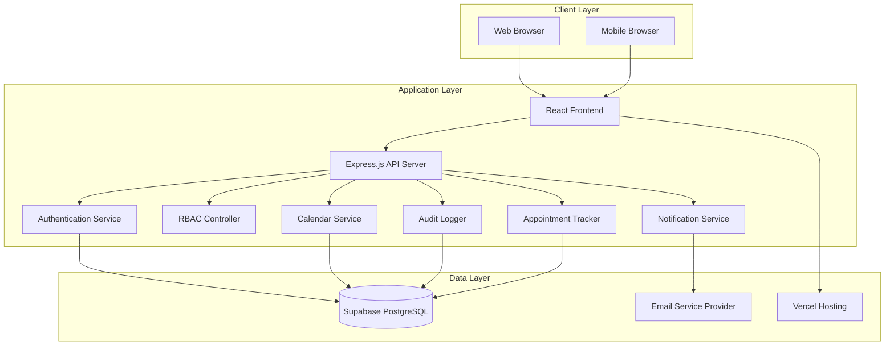

# Design Document: Appointment Booking System

## Overview

The Appointment Booking System is a web-based application built with a modern three-tier architecture consisting of a React frontend, Node.js/Express backend API, and PostgreSQL database. The system implements role-based access control (RBAC) with four distinct user roles: Client, Staff, Manager, and Admin, each with specific permissions and capabilities. Manager is a Staff member with elevated privileges (service configuration, staff assignment); both share the `staff_profiles` table and are distinguished by the `role` column. Admin has a separate `admin_profiles` table for system-wide account and audit management.

The architecture emphasizes security, scalability, and maintainability through clear separation of concerns, comprehensive audit logging, and real-time availability management. The system handles the complete appointment lifecycle from booking through completion, with automated notifications and status tracking throughout the process.

## Architecture

### System Architecture



### Technology Stack

**Frontend:**
- React 17 with TypeScript for type safety and stability
- shadcn/ui for modern, accessible component library
- Tailwind CSS for utility-first styling
- React Router for client-side routing
- Axios for API communication
- React Hook Form for form validation

**Backend:**
- Node.js with Express.js framework
- TypeScript for type safety
- JWT for session management
- bcrypt for password hashing
- node-cron for scheduled tasks
- Joi for request validation
- Supabase client for database operations
- pnpm as the package manager

**Database:**
- Supabase (PostgreSQL) for relational data storage with real-time features
- Database migrations with Knex.js
- Row Level Security (RLS) for data protection
- Real-time subscriptions for live updates

**Infrastructure:**
- Vercel for frontend hosting and deployment
- Supabase for database hosting and authentication
- Email service integration (SendGrid or similar)
- Environment-based configuration
- Structured logging with Winston

## Components and Interfaces

### Authentication Service

The Authentication Service handles all user authentication, session management, and password operations.

```typescript
interface AuthenticationService {
  // User authentication
  authenticate(email: string, password: string): Promise<AuthResult>
  createSession(userId: string, role: UserRole): Promise<SessionToken>
  validateSession(token: string): Promise<SessionInfo>
  terminateSession(token: string): Promise<void>
  
  // Password management
  validatePasswordComplexity(password: string): boolean
  hashPassword(password: string): Promise<string>
  sendPasswordResetEmail(email: string): Promise<void>
  resetPassword(token: string, newPassword: string): Promise<void>
  changePassword(userId: string, currentPassword: string, newPassword: string): Promise<void>
  
  // User registration
  registerClient(userData: ClientRegistrationData): Promise<User>
}

interface AuthResult {
  success: boolean
  user?: User
  token?: string
  error?: string
}

interface SessionInfo {
  userId: string
  role: UserRole
  isValid: boolean
}
```

### RBAC Controller

The Role-Based Access Control component enforces permissions across all system features.

```typescript
interface RBACController {
  // Permission checking
  hasPermission(userId: string, resource: string, action: string): Promise<boolean>
  enforcePermission(userId: string, resource: string, action: string): Promise<void>
  
  // Role management
  getUserRole(userId: string): Promise<UserRole>
  assignRole(userId: string, role: UserRole): Promise<void>
  
  // Service-specific access
  canAccessService(userId: string, serviceId: string): Promise<boolean>
  assignStaffToService(staffId: string, serviceId: string): Promise<void>
}

enum UserRole {
  CLIENT = 'client',
  STAFF = 'staff',
  MANAGER = 'manager',
  ADMIN = 'admin'
}

interface Permission {
  resource: string
  actions: string[]
}
```

### Permission Matrix

This table is the single source of truth for RBAC enforcement. Every API route and middleware check must map to one cell in this matrix. `✓` = allowed, `✗` = denied.

| Resource | Action | Client | Staff | Manager | Admin |
|---|---|:---:|:---:|:---:|:---:|
| **Auth** | Login / Logout | ✓ | ✓ | ✓ | ✓ |
| **Auth** | Register (self) | ✓ | ✗ | ✗ | ✗ |
| **Auth** | Password reset (own) | ✓ | ✓ | ✓ | ✓ |
| **Own Profile** | View / Edit | ✓ | ✓ | ✓ | ✓ |
| **Own Profile** | Deactivate (self) | ✓ | ✗ | ✗ | ✗ |
| **Appointments** | Book (create) | ✓ | ✗ | ✗ | ✗ |
| **Appointments** | View own | ✓ | ✗ | ✗ | ✗ |
| **Appointments** | Track by number | ✓ | ✗ | ✗ | ✗ |
| **Appointments** | View assigned service queue | ✗ | ✓ | ✓ | ✗ |
| **Appointments** | Update status / remarks | ✗ | ✓ | ✓ | ✗ |
| **Appointments** | Cancel (own, pending only) | ✓ | ✗ | ✗ | ✗ |
| **Services** | View active (booking calendar) | ✓ | ✓ | ✓ | ✗ |
| **Services** | Create / Edit / Archive | ✗ | ✗ | ✓ | ✗ |
| **Staff Assignments** | Assign staff to service | ✗ | ✗ | ✓ | ✗ |
| **Staff Assignments** | Remove staff from service | ✗ | ✗ | ✓ | ✗ |
| **Staff Assignments** | View assignments | ✗ | ✗ | ✓ | ✗ |
| **User Accounts** | Create staff account | ✗ | ✗ | ✗ | ✓ |
| **User Accounts** | Create manager account | ✗ | ✗ | ✗ | ✓ |
| **User Accounts** | View all staff / managers | ✗ | ✗ | ✗ | ✓ |
| **User Accounts** | Archive staff / manager | ✗ | ✗ | ✗ | ✓ |
| **User Accounts** | View / manage client accounts | ✗ | ✗ | ✗ | ✓ |
| **Audit Logs** | View | ✗ | ✗ | ✗ | ✓ |
| **Audit Logs** | Export | ✗ | ✗ | ✗ | ✓ |

> Note: Admin has no access to Services or Appointments by design. This is an intentional separation — admins govern accounts and audit trails, not operational workflows.

### Calendar Service

The Calendar Service manages appointment availability, prevents double booking, and handles time slot management.

```typescript
interface CalendarService {
  // Availability management
  getAvailableSlots(serviceId: string, date: Date): Promise<TimeSlot[]>
  checkSlotAvailability(serviceId: string, dateTime: Date): Promise<boolean>
  reserveSlot(serviceId: string, dateTime: Date, duration: number): Promise<boolean>
  releaseSlot(serviceId: string, dateTime: Date): Promise<void>
  
  // Service hours validation
  isWithinServiceHours(serviceId: string, dateTime: Date): Promise<boolean>
  getServiceHours(serviceId: string): Promise<ServiceHours>
}

interface TimeSlot {
  dateTime: Date
  available: boolean
  capacity: number
  booked: number
}

interface ServiceHours {
  startTime: string // HH:MM format
  endTime: string
  daysOfWeek: number[] // 0-6, Sunday-Saturday
  capacity: number
}
```

### Appointment Tracker

The Appointment Tracker generates unique tracking numbers and manages appointment identification.

```typescript
interface AppointmentTracker {
  // Tracking number generation
  generateTrackingNumber(): Promise<string>
  validateTrackingNumber(trackingNumber: string): boolean
  
  // Appointment lookup
  findByTrackingNumber(trackingNumber: string): Promise<Appointment | null>
  getAppointmentHistory(clientId: string): Promise<Appointment[]>
}
```

### Notification Service

The Notification Service handles all email communications with users.

```typescript
interface NotificationService {
  // Appointment notifications
  sendBookingConfirmation(appointment: Appointment): Promise<void>
  sendStatusUpdate(appointment: Appointment, oldStatus: string): Promise<void>
  
  // Authentication notifications
  sendPasswordResetEmail(email: string, resetToken: string): Promise<void>
  
  // System notifications
  sendSystemAlert(recipients: string[], message: string): Promise<void>
  
  // Email delivery management
  retryFailedEmails(): Promise<void>
  logEmailFailure(email: string, error: string): Promise<void>
}

interface EmailTemplate {
  subject: string
  htmlBody: string
  textBody: string
}
```

### Audit Logger

The Audit Logger records all system activities for compliance and troubleshooting.

```typescript
interface AuditLogger {
  // Action logging
  logUserAction(userId: string, action: string, resource: string, details?: any): Promise<void>
  logSystemEvent(event: string, details: any): Promise<void>
  logError(error: Error, context: any): Promise<void>
  
  // Audit retrieval
  getAuditLogs(filters: AuditFilters): Promise<AuditLog[]>
  exportAuditLogs(startDate: Date, endDate: Date): Promise<string>
}

interface AuditLog {
  id: string
  timestamp: Date
  userId?: string
  action: string
  resource: string
  details: any
  ipAddress?: string
}

interface AuditFilters {
  userId?: string
  action?: string
  resource?: string
  startDate?: Date
  endDate?: Date
}
```

## Data Models

### User Models

```typescript
interface User {
  id: string
  email: string
  passwordHash: string
  role: UserRole
  isActive: boolean
  archivedAt: Date | null  // null = active; set on archive (never hard-deleted)
  createdAt: Date
  updatedAt: Date
}

// Self-registered Filipino citizens who book appointments
interface Client extends User {
  firstName: string
  lastName: string
  phoneNumber: string
  address: string
  dateOfBirth: Date
  governmentId: string
}

// Government employees who process appointments for assigned services
interface Staff extends User {
  firstName: string
  lastName: string
  employeeId: string
  department: string
  assignedServices: string[] // Service IDs (populated via service_assignments)
}

// Staff with elevated privileges: create/configure services, assign staff to services
// Shares the staff profile table; distinguished by role = 'manager'
interface Manager extends User {
  firstName: string
  lastName: string
  employeeId: string
  department: string
}

// System-wide administrators: manage all accounts, view audit logs, generate reports
interface Admin extends User {
  firstName: string
  lastName: string
  employeeId: string
  department: string
}
```

### Appointment Models

```typescript
interface Appointment {
  id: string
  trackingNumber: string
  clientId: string
  serviceId: string
  dateTime: Date
  duration: number // minutes
  status: AppointmentStatus
  personalDetails: PersonalDetails
  requiredDocuments: string[]
  remarks?: string
  archivedAt: Date | null  // null = active; set when completed/cancelled
  createdAt: Date
  updatedAt: Date
  processedBy?: string // Staff ID
}

enum AppointmentStatus {
  PENDING = 'pending',
  CONFIRMED = 'confirmed',
  COMPLETED = 'completed',
  CANCELLED = 'cancelled',
  NO_SHOW = 'no_show'
}

interface PersonalDetails {
  firstName: string
  lastName: string
  phoneNumber: string
  email: string
  address: string
  dateOfBirth: Date
  governmentId: string
  emergencyContact?: EmergencyContact
}

interface EmergencyContact {
  name: string
  relationship: string
  phoneNumber: string
}
```

### Service Models

```typescript
interface Service {
  id: string
  name: string
  description: string
  department: string
  duration: number // minutes
  capacity: number // appointments per slot
  operatingHours: ServiceHours
  requiredDocuments: string[]
  isActive: boolean
  archivedAt: Date | null  // null = active; set on archive
  createdAt: Date
  updatedAt: Date
  createdBy: string // Manager ID
}

interface ServiceAssignment {
  id: string
  staffId: string
  serviceId: string
  isActive: boolean
  assignedAt: Date
  assignedBy: string   // Manager ID
  archivedAt: Date | null  // null = active; set when assignment is removed
  archivedBy: string | null  // Manager ID who removed the assignment
}
```

### Database Schema

```sql
-- ============================================================
-- SOFT-DELETE POLICY
-- No records are ever permanently deleted in this system.
-- All "deletions" are archives: archived_at is set to the
-- current timestamp and is_active is set to false.
-- ON DELETE CASCADE is intentionally omitted; profile rows
-- remain as historical records even if the parent user row
-- is archived.
-- ============================================================

-- ============================================================
-- USERS (base identity table for all roles)
-- role: 'client' | 'staff' | 'manager' | 'admin'
--   client  → has a row in clients
--   staff   → has a row in staff_profiles
--   manager → has a row in staff_profiles (elevated role)
--   admin   → has a row in admin_profiles
-- ============================================================
CREATE TABLE users (
  id UUID PRIMARY KEY DEFAULT gen_random_uuid(),
  email VARCHAR(255) UNIQUE NOT NULL,
  password_hash VARCHAR(255) NOT NULL,
  role VARCHAR(20) NOT NULL CHECK (role IN ('client', 'staff', 'manager', 'admin')),
  is_active BOOLEAN DEFAULT true,
  archived_at TIMESTAMP DEFAULT NULL,  -- NULL = active; set on archive
  created_at TIMESTAMP DEFAULT CURRENT_TIMESTAMP,
  updated_at TIMESTAMP DEFAULT CURRENT_TIMESTAMP
);

-- ============================================================
-- CLIENTS — self-registered Filipino citizens
-- ============================================================
CREATE TABLE clients (
  user_id UUID PRIMARY KEY REFERENCES users(id),
  first_name VARCHAR(100) NOT NULL,
  last_name VARCHAR(100) NOT NULL,
  phone_number VARCHAR(20) NOT NULL,
  address TEXT NOT NULL,
  date_of_birth DATE NOT NULL,
  government_id VARCHAR(50) NOT NULL
);

-- ============================================================
-- STAFF PROFILES — shared by both 'staff' and 'manager' roles
-- Managers are distinguished by users.role = 'manager'.
-- Only managers may create services and assign staff.
-- ============================================================
CREATE TABLE staff_profiles (
  user_id UUID PRIMARY KEY REFERENCES users(id),
  first_name VARCHAR(100) NOT NULL,
  last_name VARCHAR(100) NOT NULL,
  employee_id VARCHAR(50) UNIQUE NOT NULL,
  department VARCHAR(100) NOT NULL
);

-- ============================================================
-- ADMIN PROFILES — system-wide administrators
-- Created only by other admins (or seeded).
-- Manage all user accounts, view audit logs, generate reports.
-- ============================================================
CREATE TABLE admin_profiles (
  user_id UUID PRIMARY KEY REFERENCES users(id),
  first_name VARCHAR(100) NOT NULL,
  last_name VARCHAR(100) NOT NULL,
  employee_id VARCHAR(50) UNIQUE NOT NULL,
  department VARCHAR(100) NOT NULL
);

-- ============================================================
-- SERVICES — configured by managers
-- ============================================================
CREATE TABLE services (
  id UUID PRIMARY KEY DEFAULT gen_random_uuid(),
  name VARCHAR(200) NOT NULL,
  description TEXT,
  department VARCHAR(100) NOT NULL,
  duration INTEGER NOT NULL,           -- minutes per appointment slot
  capacity INTEGER NOT NULL DEFAULT 1, -- max concurrent appointments per slot
  start_time TIME NOT NULL,
  end_time TIME NOT NULL,
  days_of_week INTEGER[] NOT NULL,     -- 0=Sunday … 6=Saturday
  required_documents TEXT[],
  is_active BOOLEAN DEFAULT true,
  archived_at TIMESTAMP DEFAULT NULL,  -- NULL = active; set on archive
  created_at TIMESTAMP DEFAULT CURRENT_TIMESTAMP,
  updated_at TIMESTAMP DEFAULT CURRENT_TIMESTAMP,
  created_by UUID REFERENCES users(id) -- must be a manager
);

-- ============================================================
-- APPOINTMENTS — booked by clients, processed by staff/managers
-- ============================================================
CREATE TABLE appointments (
  id UUID PRIMARY KEY DEFAULT gen_random_uuid(),
  tracking_number VARCHAR(20) UNIQUE NOT NULL,
  client_id UUID NOT NULL REFERENCES clients(user_id),
  service_id UUID NOT NULL REFERENCES services(id),
  appointment_date_time TIMESTAMP NOT NULL,
  duration INTEGER NOT NULL,
  status VARCHAR(20) NOT NULL DEFAULT 'pending'
    CHECK (status IN ('pending', 'confirmed', 'completed', 'cancelled', 'no_show')),
  personal_details JSONB NOT NULL,     -- snapshot of client details at booking time
  required_documents TEXT[],
  remarks TEXT,
  archived_at TIMESTAMP DEFAULT NULL,  -- NULL = active; set when completed/cancelled
  created_at TIMESTAMP DEFAULT CURRENT_TIMESTAMP,
  updated_at TIMESTAMP DEFAULT CURRENT_TIMESTAMP,
  processed_by UUID REFERENCES staff_profiles(user_id) -- staff or manager who last acted
);

-- ============================================================
-- SERVICE ASSIGNMENTS — managers assign staff to services
-- Soft-deleted via is_active = false + archived_at timestamp.
-- Historical assignments are preserved for audit purposes.
-- ============================================================
CREATE TABLE service_assignments (
  id UUID PRIMARY KEY DEFAULT gen_random_uuid(),
  staff_id UUID NOT NULL REFERENCES staff_profiles(user_id),
  service_id UUID NOT NULL REFERENCES services(id),
  is_active BOOLEAN DEFAULT true,
  assigned_at TIMESTAMP DEFAULT CURRENT_TIMESTAMP,
  assigned_by UUID REFERENCES users(id), -- must be a manager
  archived_at TIMESTAMP DEFAULT NULL,    -- NULL = active; set on removal
  archived_by UUID REFERENCES users(id)  -- manager who removed the assignment
);

-- Unique constraint only on active assignments to allow re-assignment after archive
CREATE UNIQUE INDEX idx_service_assignments_active
  ON service_assignments(staff_id, service_id)
  WHERE is_active = true;

-- ============================================================
-- AUDIT LOGS — immutable record of all system actions
-- ============================================================
CREATE TABLE audit_logs (
  id UUID PRIMARY KEY DEFAULT gen_random_uuid(),
  timestamp TIMESTAMP DEFAULT CURRENT_TIMESTAMP,
  user_id UUID REFERENCES users(id),   -- actor (NULL for system events)
  action VARCHAR(100) NOT NULL,
  resource VARCHAR(100) NOT NULL,
  details JSONB,
  ip_address INET
);

-- ============================================================
-- INDEXES
-- ============================================================
CREATE INDEX idx_appointments_client_id ON appointments(client_id);
CREATE INDEX idx_appointments_service_id ON appointments(service_id);
CREATE INDEX idx_appointments_date_time ON appointments(appointment_date_time);
CREATE INDEX idx_appointments_tracking_number ON appointments(tracking_number);
CREATE INDEX idx_appointments_status ON appointments(status);
CREATE INDEX idx_appointments_archived_at ON appointments(archived_at);
CREATE INDEX idx_audit_logs_timestamp ON audit_logs(timestamp);
CREATE INDEX idx_audit_logs_user_id ON audit_logs(user_id);
CREATE INDEX idx_users_role ON users(role);
CREATE INDEX idx_users_archived_at ON users(archived_at);
CREATE INDEX idx_services_archived_at ON services(archived_at);

-- ============================================================
-- VIEWS — elevated manager visibility
-- ============================================================

-- All staff accounts with their active assigned services (manager dashboard)
CREATE VIEW manager_staff_overview AS
SELECT
  u.id            AS user_id,
  u.email,
  u.role,
  u.is_active,
  u.archived_at,
  sp.first_name,
  sp.last_name,
  sp.employee_id,
  sp.department,
  COALESCE(
    json_agg(
      json_build_object(
        'service_id',   sa.service_id,
        'service_name', svc.name,
        'assigned_at',  sa.assigned_at,
        'assigned_by',  sa.assigned_by
      )
    ) FILTER (WHERE sa.service_id IS NOT NULL AND sa.is_active = true),
    '[]'
  ) AS assigned_services
FROM users u
JOIN staff_profiles sp ON sp.user_id = u.id
LEFT JOIN service_assignments sa  ON sa.staff_id = u.id
LEFT JOIN services svc            ON svc.id = sa.service_id
WHERE u.role = 'staff'
GROUP BY u.id, u.email, u.role, u.is_active, u.archived_at,
         sp.first_name, sp.last_name, sp.employee_id, sp.department;

-- All appointments across all services (manager oversight — active and archived)
CREATE VIEW manager_appointments_overview AS
SELECT
  a.*,
  svc.name        AS service_name,
  svc.department  AS service_department,
  svc.created_by  AS service_manager_id
FROM appointments a
JOIN services svc ON svc.id = a.service_id;
```